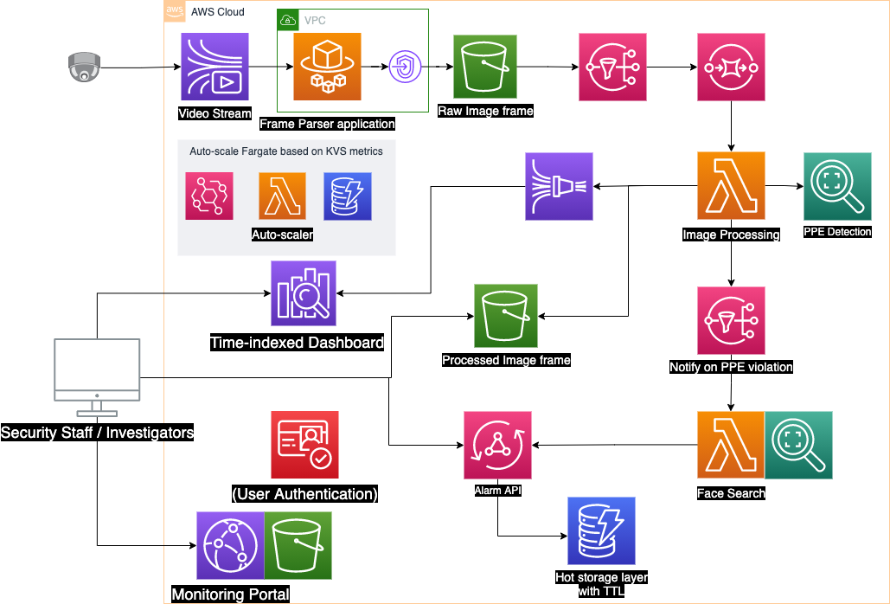
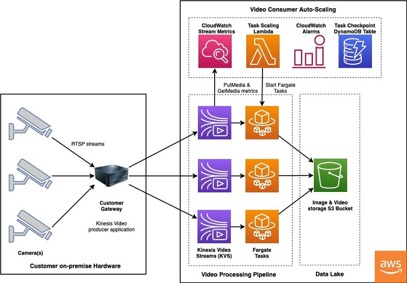
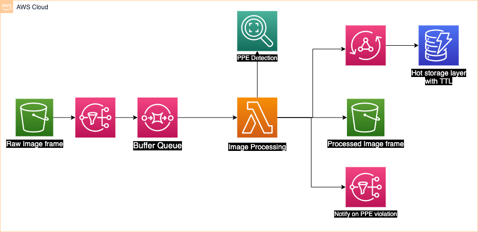

# Real-time Video Analytics for PPE Compliance

For many enterprises, petabytes of data are generated from their CCTV everyday, however they are often untapped. Facial Rekognition, social distancing measurement, protective equipment detection, or accident prevention are just examples of common use cases of real-time video analytics. With [Amazon Rekognition](https://aws.amazon.com/rekognition/), you can obtain insights from video without ML knowledge, and with slightly more efforts, [Amazon Sagemaker](https://aws.amazon.com/sagemaker/) can be used to deploy ML model for advanced use cases.

This solution demonstrates streaming videos from cameras of any kind to AWS for real-time analytics on PPE compliance, using Amazon Rekognition, and visualize such data in a dashboard and a monitoring portal. While this example mainly focus on PPE compliance, the general architecture can be applied for other use cases as well (i.e. intrusion detection, people tracking/counting, etc)

## Architecture

The solution is comprised of different parts, and can be broken down into the following sections:

* <b>[Video Injestion](#video-injestion) </b>
* <b>[Raw video Processing](#raw-video-processing) </b>
* <b>[Inference Pipeline](#inference-pipeline) </b>
* <b>[Alerting and result presentation](#alerting-and-result-presentation) </b>
* <b>[Analytics Dashboard](#analytics-dashboard) </b>

### Video Injestion

The injestion of video is done via Kinesis Video Streams (KVS), it enables video producers of any kind (ip cameras, CCTV, Raspberry Pi, or even your laptop) to efficiently transfer video data to the cloud securely. 

 > The recommended way to use KVS is via the [GStreamer plugin](https://docs.aws.amazon.com/kinesisvideostreams/latest/dg/examples-gstreamer-plugin.html). While GStreamer is an application that is considered too heavy to install in a typical embedded device, for prototyping or architectures that can leverage an edge video gateway (aggregating cameras from different sources), using Gstreamer abstracts you away from many video encoding/transmuxing details and Gstreamer is extensible to other plugins, like applying ML filter before sending videos to KVS, or integrate with [Nvidia DeepStream SDK](https://developer.nvidia.com/deepstream-sdk)

### Raw Video Processing

The architecture for raw video processing is inspired from the Proserv team's brilliant [blog post](https://aws.amazon.com/blogs/machine-learning/accelerating-the-deployment-of-ppe-detection-solution-to-comply-with-safety-guidelines/), where they introduced a scalable pattern for processing KVS video streams using a fleet of auto-scaling Fargate tasks (Using the [KVS Parser Library](https://github.com/aws/amazon-kinesis-video-streams-parser-library) in Java), scaled using KVS producer and consumer metrics, when there is no video in, consuming task can be shut down, and when video is coming in, a task is spawned to consume on the video stream. The only difference betweeen the implementation is that here the DynamoDB table only stores which Fargate task is consuming which video stream, and no checkpointing logic is implemented.

### Inference Pipeline

The inference pipeline consists of a few steps, when video frame is uploaded in the raw frame bucket, an S3 event is triggered, going through SNS to SQS, picked up by a Lambda worker to do PPE Analysis using Rekognition's PPE API. The reason for this design is due to Rekognition PPE's API hard limit of 5 concurrent invocation per account/region, so the concurrency of the Lambda must be controlled at a maximum of 5, regardless of how many video streams. Prior and after calling the Rekognition PPE API, there are some image resizing and format conversion done by the Lambda, processed images are stored in a destination bucket in webp format, which greatly reduces image size (3xxKB -> 2xKB). For each processed frames, the result are persisted in an ElasticSearch domain for analytics (to be explained [later](#analytics-dashboard))

For SageMaker-based inference solutions, the architecture can be simplified by having the KVS Consumer Fargate task directly invoking the Sagemaker endpoint, saving a lot of load-levelling resources.

### Alerting and result presentation

If Rekognition PPE detects violation case, an SNS notification is sent to a downstream Lambda. The Lambda function will perform a face search against stored faces, to identify the person without PPE. After the bounding boxes are drawn, an alert is sent to an AppSync API, after which to be stored in a DynamoDB table. From the monitoring portal (a custom Web UI), users can see a list of alerts with number of PPE violation in each of them, and also the image.

### Analytics Dashboard

Kibana dashboard is used for visualizing the PPE violation data over a time-series. Key metrics that can be created include number of violations in a given time period, person/camera with most violations, etc.

## Deployment

